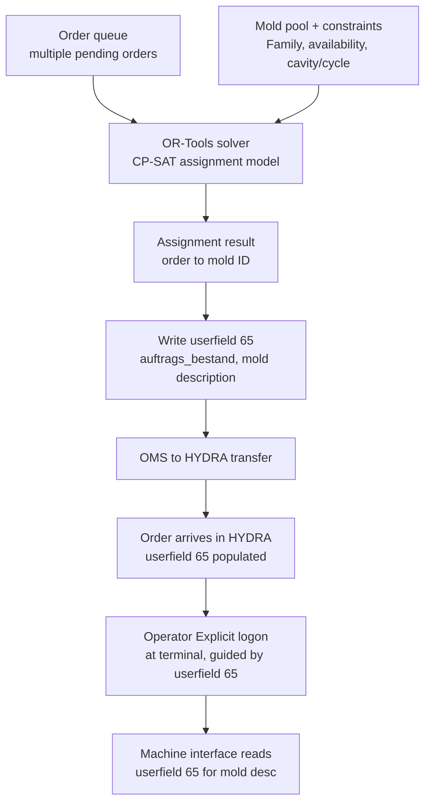

# Implementation Plan: OR-Tools Mold Pre-Assignment (Soft Path)

**Last updated:** 2026-07-09 | **Owner:** congdat.nguyen@framas.com
**Status:** Draft — Phase 1 (soft path) approved for build. Hard-enforcement path (API-driven logon) deferred pending HYDRA API capability check.

> [!note] Context: [[sop_hydra-multi-mold-machine]] — the HYDRA-side Required Resource / mold pool mechanism this plan builds on top of. This plan does **not** change HYDRA configuration (WRM Required Resource, Family, Explicit logon all stay as documented there). It adds an external planning layer that decides *which* mold to use per order ahead of time, and pushes that decision into HYDRA via a custom field.

## Problem

HYDRA's Required Resource pattern resolves "which mold" at order logon time (terminal), either implicitly (system default) or explicitly (operator picks from the pool). This is correct for flexible, late-binding mold assignment — but does not support **advance planning**: deciding today which specific mold ID will run tomorrow's order, across multiple concurrent orders competing for a shared mold pool.

We need to plan mold assignment ahead of time, across multiple orders, respecting pool membership, mold availability, and target cycle/cavity constraints — then communicate that decision into HYDRA so the machine interface has the correct mold description at hand.

## Chosen approach: soft path

External OR-Tools solver computes the order→mold assignment. The result is written into `auftrags_bestand` custom field **userfield 65** (mold description) before/at OMS→HYDRA transfer. The machine interface reads userfield 65 directly — no HYDRA configuration change required. Operators still perform Explicit logon at the terminal, guided by the planned mold shown in userfield 65. No hard enforcement: if the operator logs a different mold than planned, nothing blocks it today. Userfield 65 is refreshed on every re-plan to stay in sync with actual conditions — no drift-detection/flagging in this phase.

Hard path (external system programmatically logging the resource onto the OP, enforcing the plan) is out of scope until HYDRA API/web-service docs are reviewed for a "log on production resource via API" capability — not confirmed to exist as of this writing.

## Architecture / data flow

## Phase 1 — Assignment engine (OR-Tools)

**Goal:** given a set of pending orders and the current mold pool, produce an order→mold assignment.

Inputs needed:
- Order queue: order ID, required Family/Required-resource pool, quantity, due date/sequence priority.
- Mold pool per Family: mold IDs (`WNR` resources), Target cycle, Original/Current partitioning (cavities).
- Mold availability: read from `res_ress_belegung` (occupancy table, `belegungsart = 'A'` for order bookings, `'S'`/`'W'` for lock/maintenance windows) — confirmed schema in [[sop_hydra-multi-mold-machine]] Appendix.
- Changeover consideration (if mold swap has downtime cost — confirm with production whether this matters for v1).

Constraints/objective (draft — refine with production planning input):
- Each order assigned exactly one mold from its Family's pool.
- No two concurrent orders assigned the same mold at overlapping time windows (unless multi-cavity/parallel logon applies — check against Step 9 "Logon of several OPs" / "Parallel logon/planning possible" from the SOP if relevant).
- Minimize changeovers / maximize due-date adherence (objective TBD with planning team).

Data access: read-only query against HYDRA DB tables identified in the SOP (`res_bestand`, `res_bedarfszuord`, `res_ress_belegung`). Confirm read access path (direct DB read vs. exposed view/API) before building — **open question**, see below.

Output: order ID + assigned mold ID + mold description string, one row per order.

## Phase 2 — Write-back to userfield 65

**Goal:** get the Phase 1 assignment into `auftrags_bestand.userfield65` before the order transfers from OMS into HYDRA.

Open question to resolve before build: does OMS expose an extensibility hook to inject a custom field value during transfer, or does the write happen via a direct DB update to `auftrags_bestand` (pre- or post-transfer), or via a HYDRA-side API? Pick the mechanism that fits existing OMS/HYDRA integration patterns — needs input from whoever owns the OMS→HYDRA transfer today.

Re-plan behavior: userfield 65 is **overwritten** on every solver re-run to reflect current conditions (no versioning/history needed for v1). If an order's assignment changes after transfer but before production start, re-write is still possible as long as HYDRA allows updating userfield 65 post-transfer — confirm this.

## Phase 3 — Operator guidance

**Goal:** operator sees the planned mold at the terminal and performs Explicit logon accordingly.

- Confirm userfield 65 (or a derived display) is visible on the AIP terminal screen at logon time, not just consumed silently by the machine interface.
- No system-enforced block on mismatched logon in this phase — process/training control only.
- Consider (future) a simple report/dashboard comparing planned mold (userfield 65 history) vs. actually logged mold (`res_ress_belegung`) for manual review, without building hard enforcement yet.

## Out of scope for this plan (deferred)

- **Hard enforcement**: external system programmatically logging the planned resource onto the OP so the terminal has no wrong-choice window. Requires confirming a HYDRA API/web-service capability for external logon — not yet checked against any doc set. Revisit after soft path is running and mismatch rate is measured.
- Automatic mismatch flagging/alerting between planned and actual mold.

## Open questions (block Phase 1/2 start)

1. DB/API access path for reading `res_bestand` / `res_bedarfszuord` / `res_ress_belegung` from an external solver — direct read replica, exposed view, or existing integration layer?
2. Write mechanism for `userfield65` on `auftrags_bestand` — OMS hook vs. direct DB write vs. HYDRA API. Who owns this integration point today?
3. Does the AIP terminal surface userfield 65 (or a derived label) to the operator at logon, or does it only feed the machine interface silently? If not currently visible, needs a terminal-side display change.
4. Changeover cost / multi-order parallel-mold cases (SOP's "Parallel logon/planning possible") — do these apply to the order mix OR-Tools will plan for, or is single-mold-per-order sufficient for v1?
5. Re-plan frequency — batch (e.g. nightly) vs. event-triggered (new order arrives, mold goes down)?

## Rollout checklist

1. Resolve open questions 1–2 (data read path, write path) with OMS/HYDRA integration owner.
2. Build Phase 1 solver against a static/test dataset pulled from the confirmed schema (`res_bestand`, `res_bedarfszuord`, `res_ress_belegung`).
3. Validate assignment output against a known manual plan (sanity check, not yet wired to HYDRA).
4. Build Phase 2 write-back, test against a non-production order/mold pair.
5. Confirm terminal visibility (open question 3); adjust display if needed.
6. Pilot on one machine/mold pool, compare planned vs. logged mold manually for a trial period.
7. Decide whether to pursue hard-enforcement path based on pilot mismatch rate.

## Related

- [[sop_hydra-multi-mold-machine]] — HYDRA-side Required Resource / Family / cavity SOP this plan builds on
- [[hydra-multi-mold-machine]] — Q&A background page
- `auftrags_bestand.userfield65` — custom order field, mold description, consumed by machine interface (confirmed by user, not present in Oct 2020 HYDRA doc set — operational/custom knowledge)
