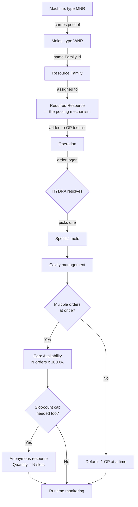
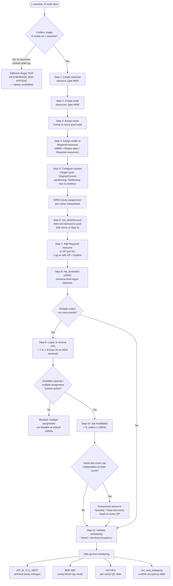

# How to Configure a Multi-Slot Mold Machine as a Meta-Resource in HYDRA

**Last updated:** 2026-07-09 | **Owner:** congdat.nguyen@framas.com

> [!note] You might be looking for: [[hydra-multi-mold-machine]] — Q&A page with the res_familie-vs-Required-resource clarification and runtime query examples. [[HYDRA Multi-Tool Resource Configuration]] — full field-level reference this SOP is condensed from.

> [!info] Rewritten from primary sources. Every statement below is re-verified against the raw HYDRA 8 documentation set at `.raw/hydra/HYDRA_8_Documentation Oct 2020/` (1,556 PDFs — function docs, product release notes, glossary), with the specific PDF and page cited inline. Where a claim in the previous version could only be traced to `CUT-HDB_DataModel_2021.pdf` — a separate 846-page database/PDM schema reference that sits **outside** the `HYDRA_8_Documentation Oct 2020` folder — it was originally flagged explicitly as a gap rather than silently cited. **Update 2026-07-09:** every flagged gap has now been checked directly against `.raw/hydra/CUT-HDB_DataModel_2021.pdf` (846 pages, WRM table reference §13, pp.769–785) and is either confirmed with an exact PDM field citation or, in the one case that didn't resolve, marked still-open below. **Second pass, same day:** the two remaining ⚠ items (`TEM` resource-type code, `res_ress_belegung` SQL) were re-checked against the full Oct 2020 doc set — `TEM` was found on a second predefined-type table the first pass hadn't opened (`MOC_ResourceConfiguration.pdf` p.2), and the SAP-interface docs `SCS-PDM_81.pdf`/`SCS-SIF_81.pdf` supplied the `res_ress_belegung` write-trigger logic CUT-HDB's schema-only listing didn't include. Only the alternate-shape function names (HLS-MFB/HLS-AGS/BDE-APF/BDE-SSG) and a literal, verified SQL query set remain open — see Appendix.

## Overview

Use this process when one physical machine holds several molds at once and a single production order must drive all mounted molds together. Do **not** model each mold as a separate machine — model the machine as a resource that carries a list of mounted tools (molds), with each mold as a subordinate tool resource.

**Pattern:** Meta-resource (machine) + Required resource (mold pool) + Cavity management.
**HYDRA modules involved:** WRM (Tool & Resource Management), HLS (Shop Floor Scheduling), BDE (Shop Floor Data Collection), AIP (Windows terminal client), MOC (Management Cockpit — where these are configured).
(Source: `.raw/hydra/HYDRA_8_Documentation Oct 2020/Functions/MOC/MOC_ResourceConfiguration.pdf`, p.1 — menu path `Master Data > Resources > Workplace and Resource Configuration`.)

## Before you start

- Confirm which shape you actually have. This SOP is for **1 machine, N mold slots** (molds physically mounted in slots on one machine). If instead you have **N separate machines each running a share of one order's quantity in parallel**, this SOP does not apply — see "If you have a different shape instead" below.
- Confirm you have MOC access to **Workplace and Resource Configuration**.
- Confirm you have WRM access to **Master data → Required resources** and **Cavity assignment**.
- Confirm the "Available capacity / multiple assignment" license is active if more than one order will run on the machine at once — this field is license-gated (`.raw/.../Functions/MOC/MOC_ResourceConfiguration.pdf`, p.14: *"This function requires a corresponding license."*).
- Confirm the auto-planning extension `graptsbap` is enabled if you plan to rely on automatic scheduling for multi-order capacity (`.raw/.../Functions/MOC/MOC_SchedulingAndAllocation.pdf`, p.10: *"This option is only available if you enable the extension graptsbap."*).

## Steps

1. **Create the machine resource, type `MNR`.** In MOC, under **Master Data → Resources → Resource types**, `MNR` is one of the predefined resource-type codes ("Machine" = `MNR`). (Source: `.raw/.../Functions/MOC/MOC_ResourceTypes.pdf`, p.1 — table of MPDV-predefined resource types: Machine=`MNR`, Tool=`WNR`, Staff=`PER`, Gage=`PRM`, Device=`VOR`, DNC-Programm=`DNC`, Document=`DOC`, Energy counter=`ENE`.)
   > [!success] Resolved: the previous version of this SOP also referenced resource types `WZ` (mold) and `TEM` (tempering equipment). Neither appears on the short predefined-type table on p.1 of `MOC_ResourceTypes.pdf` (8 core codes: `MNR`/`WNR`/`PER`/`PRM`/`VOR`/`DNC`/`DOC`/`ENE` — the ones users cannot delete). But `MOC_ResourceConfiguration.pdf` p.2 carries a second, longer "Predefined resource types" table under the **Resource type** field description, listing 12 codes: `DNC`, `DOC`, `ENE`, `ENT` (Removal device), `MNR`, `PAC` (Packaging/transport container), `PRM`, `PER`, `PRU` (Setup staff), **`TEM` (Tempering equipment)**, `VOR`, `WNR`. `TEM` was simply on the page we hadn't checked. `CUT-HDB_DataModel_2021.pdf` (p.784, table `res_ress_typen`, field `typ`) separately confirms `WZ` (`M = Maschine`, `WZ = Werkzeug`) as the HLS-side occupancy lookup used by `res_ress_belegung` (see "After this process" below) — a different table from the MOC resource-type list, so both `WNR` (MOC-level) and `WZ` (HLS occupancy-level) are correct depending on which layer you're looking at. Continue creating mold resources as type `WNR` per Step 2.
   > Also confirmed in CUT-HDB: `res_bestand.meta_res` (p.775, PDM `RES.OPT:METARES`, char(1)) — *"J = Meta resource, i.e. has resource list"*. This is the field-level home of the "machine carries a list of mounted tools" behavior this SOP is built around; it just isn't described under that name in the Oct 2020 docs (which cover it functionally via Steps 7–9 instead).

2. **Create the mold resources, type `WNR`.** In MOC, create one resource per mold in the pool, resource type `WNR` ("Tool"). (Source: same table, `.raw/.../Functions/MOC/MOC_ResourceTypes.pdf`, p.1.)

3. **Assign a resource family to every mold in the pool.** In the resource's **Configuration** tab, set the **Family\*** field to the same family id on every mold that belongs together. *"Assign a resource family. If you change the resource family subsequently, an information dialog appears as a warning because user fields might possibly be assigned via the resource family."* (Source: `.raw/.../Functions/MOC/MOC_ResourceConfiguration.pdf`, p.26.)
   > [!success] Resolved via CUT-HDB: the underlying PDM field name for this — `res_bestand.res_familie` (integer, designation "Resource family", PDM `RES.RESFAMID`) — is confirmed at `.raw/hydra/CUT-HDB_DataModel_2021.pdf`, p.776. The family itself is defined as its own master-data row in table `res_familien` (PDM `RESFAM.RESFAMID`, serial), same source p.780. This was not present anywhere in the Oct 2020 documentation set — only the UI field label "Family\*" is — which is why it wasn't cited in the original version.
   > [!warning] Gap: the Family field only labels which molds belong together — the Oct 2020 docs do not describe it as the pooling mechanism. Step 4 (Required resource) is what actually makes HYDRA pick from the group.

4. **Assign the molds to a Required resource — this is the actual pooling mechanism.** On the mold's Configuration tab, the same option field that controls Anonymous/Required resource behavior reads: *"Required resource: A required resource stands for one or more actual resources that can be identified. Specify in the configuration WRM: Master data > Required resources which resources are represented by a required resource. The number results from the number of actual resources assigned to the required resource. Please note: If this field is empty, the resource is implicitly an ('actual') resource."* (Source: `.raw/.../Functions/MOC/MOC_ResourceConfiguration.pdf`, p.26.) In WRM, go to **Master data → Required resources** and assign all pool molds to one Required resource. At order logon, HYDRA resolves the Required resource to one specific mold from the assigned set.
   - The same field also defines the alternative, **Anonymous resource**: *"An anonymous resource cannot be uniquely identified. If the identifier is set, then you can change the value in the field Number from 1 to another positive integer value. You cannot post data onto anonymous resources because anonymous resources do not relate to one specific resource."* — and the related **Quantity** field: *"A value > 1 indicates how many of these resources are available. This field is calculated automatically for required resources."* (Same source, p.26.) Anonymous resources are used later in this SOP for slot-count capping, not for individual mold identity — see "If multiple orders share the machine instead."

5. **Configure cavities on each mold.** On the mold's Configuration tab:
   - **Target cycle**: *"Target duration in seconds for 1000 machine cycles if this tool is used. ... The target cycle stored in the OP is relevant for the planning in the HLS module and for the machine data collection at the terminal."*
   - **Original partitioning**: *"Partitioning of the tool (= number of cavities) when using this tool."*
   - **Current partitioning**: *"Current partitioning of the tool. This value can deviate from the original partitioning, e.g. if the original quantity can no longer be produced with one cycle/clock due to a tool defect. Always use the current partitioning to post cycles to the tool."*
   - **Partitioning due to cavities**: *"If you set the option ... the system (re-)calculates the fields 'current partitioning' and 'original partitioning' using the values defined in the cavity management. Then, you can no longer change the fields manually."*
   (Source: `.raw/.../Functions/MOC/MOC_ResourceConfiguration.pdf`, p.27.)
   - To actually manage individual cavities once "Partitioning due to cavities" is enabled, use **WRM Cavity Management**, menu **Master data → Resources → Cavity assignment**: *"The function allows to manage single cavities of a resource. All cavities together specify the partitioning of [the resource]."* Each cavity has a unique **Cavity number** and can be individually released or locked, optionally with a reason for the lock. *"If the option Partitioning due to cavities is enabled ... and if you then change the cavity assignment, then the following fields are updated: The field Original partitioning shows the number of all cavities assigned. The field Current partitioning shows the number of cavities that are not locked."* (Source: `.raw/.../Products/WRM_82/WRM-NST_82.pdf`, p.4–6.)

6. **Link the order's tool demand to the mold pool.**
   > [!success] Resolved via CUT-HDB: the link table `res_bedarfszuord` ("Required Resources", Product WRM) is confirmed at `.raw/hydra/CUT-HDB_DataModel_2021.pdf`, p.770, with exactly the fields the previous version named: `res_nr_m` — *"Resource number of superordinate resource = required resource"* (PDM `RESBEDRES.RES:M`) — and `res_nr_t` — *"Resource number of subordinate resource"* (PDM `RESBEDRES.RES:T`) — plus `res_typ_m`/`res_typ_t` (PDM `RESBEDRES.RESTYP:M`/`RESBEDRES.RESTYP:T`) for the corresponding resource types. This table is the database-level record of the same Required-resource-to-mold assignment done through the WRM UI in Step 4; it is not documented under this name anywhere in the Oct 2020 docs. Step 7 below remains the UI-level mechanism that achieves the same result at the operation level.

7. **Add the Required resource to the operation's production-resource-and-tool list, with Log on with OP = Explicit.** *"Use this option to specify whether or not you want to log on the resource with the OP. To do so, the resource must be included as a component in the operation's list of production resources and tools. Possible values: None: The resource is not logged on. Implicit: The system automatically (implicitly) logs on the resource that is assigned to the operation as a production resource and tool; you can neither log on the resource manually (explicitly) nor change the logon. Explicit: You can manually (explicitly) log on the resource that is assigned to the operation as a production resource and tool or you can log on another resource instead. If you do not log on the resource or another resource explicitly, the system implicitly (automatically) logs on the current resource; in this way, the current resource serves as a 'default'. ... For this reason, you can only log on those resources explicitly (manually) that are included as a requirement in the operation's list of production resources and tools."* (Source: `.raw/.../Functions/MOC/MOC_ResourceConfiguration.pdf`, p.28.) Use **Explicit** whenever the mounted mold count or identity varies per run — the operator scans whichever molds are physically mounted, choosing only from tools already listed on the operation.

8. **Set the logon-with-OP behavior at the resource level, if applicable.**
   > [!success] Resolved via CUT-HDB: `res_bestand.mit_anmelden` (char(1), designation "resource is logged on/off with the OP", PDM `RES.OPT:AUTOANMELD`) is confirmed at `.raw/hydra/CUT-HDB_DataModel_2021.pdf`, p.775, with values *"J = Log resource on with order in case of A_AN or log it off in case of A_AB / N = Do not log on/log off resource with order (for DNC always N) / E = explicit log on / Changing allowed (as of version WRM 7.2)"* — the J/N/E set the previous version claimed. This is the database-level field behind the **Log on with OP** UI control documented in Step 7 (None/Implicit/Explicit); it was not present under this name anywhere in the Oct 2020 documentation set.

9. **Enable simultaneous bookings if multiple orders will run on the machine at once — "Logon of several OPs."** *"Select this option, if several different operations should be processed on the machine. Otherwise, the system only allows one operation to be logged on to the machine. Possible values: Y — Log on as many OPs as required at the same time. Please note: The system allows a maximum of 20 operations to be logged on simultaneously to a machine, if the machine is assigned to a terminal with operation mode MDE. If more than 20 operations must be logged on at the same time, MPDV must review the conditions in order to remove the limitation. ... N — You can log on one OP only. 1...9 — You can log on a maximum of n OPs."* (Source: `.raw/.../Functions/MOC/MOC_ResourceConfiguration.pdf`, p.11.) Related field **Parallel logon/planning possible**: *"You can log on/plan the tool simultaneously. ... In this case, the system posts data proportionately: Post quantities proportionally. Post times 100% for each resource — this means that the system posts double the time to the resource, if the resource is logged on twice."* (Same source, p.28.)
   > [!success] Resolved via CUT-HDB: `res_bestand.mehrfach` (char(1), designation "can be logged on", PDM `RES.OPT:MULTIMNR`) is confirmed at `.raw/hydra/CUT-HDB_DataModel_2021.pdf`, p.775 — *"can be logged on (several times/simultan[eously])"*. Not found under this name in the Oct 2020 docs; the two verified UI-level fields covering simultaneous use remain "Logon of several OPs" (machine-level, p.11) and "Parallel logon/planning possible" (resource-level, p.28), cited above. `mehrfach`/`MULTIMNR` is the resource-level database flag behind that behavior.

10. **Set the "Availability" capacity field if several orders run on the machine concurrently.** *"Define the available capacity of a workplace/machine. The default value for the available capacity is 1000 [per mill]."* ... *"In the Shop Floor Scheduling, the capacity check and automatic assignment assume that each operation has a capacity requirement of 1000 [per mill], i.e. exactly one operation can run on the workplace/machine at a time. In case of a manual multiple assignment, a dialog informs you about the double assignment. If you use the automatic assignment, multiple assignments are generally not feasible. Use this setting to extend the availability of the workplace such that a multiple assignment is permitted. If the workplace capacity allows, for example, processing of two operations at the same time, set the available capacity to 2000 [per mill] in this field. ... This function requires a corresponding license."* (Source: `.raw/.../Functions/MOC/MOC_ResourceConfiguration.pdf`, p.13–14.) See "If multiple orders share the machine instead" below for how this combines with a slot-count cap.

11. **Validate before releasing to production.** Confirm the scheduling board and terminal show the expected mold occupancy for a test order — see "After this process" below for the specific checks.

## If multiple orders share the machine instead

Production reality is often two independent constraints at once, not one: how many **orders** the machine may run in parallel, and how many **mold slots** are physically available regardless of order count.

| Cap | Field | Governs | Set to | Source |
|-----|-------|---------|--------|--------|
| Parallel **orders** | Availability (a.k.a. "Available capacity [per mill]") — machine resource | How many operations may run at once | N_orders × 1000 (blank/0 = default 1000 = one OP at a time) | `.raw/.../Functions/MOC/MOC_ResourceConfiguration.pdf`, p.13–14 |
| Parallel **molds/slots** | Anonymous resource, **Quantity** field | Total molds mounted across all concurrent orders | Fixed physical slot count | `.raw/.../Functions/MOC/MOC_ResourceConfiguration.pdf`, p.26 |
| Terminal ceiling | Logon of several OPs = `Y` | Max operations logged on at once on an MDE terminal | ≤ 20 (beyond 20, MPDV must review) | `.raw/.../Functions/MOC/MOC_ResourceConfiguration.pdf`, p.11 |

To cap total mounted molds independent of order count: create a separate **anonymous resource** with **Quantity = N** (the fixed slot count — *"A value > 1 indicates how many of these resources are available"*, p.26) and list it on every operation. Shop Floor Scheduling's capacity check covers this: *"The system checks if planning results in any capacity overloads. The system checks the workplace [and] the production resources and tools assigned"* to the operation. (Source: `.raw/.../Functions/MOC/MOC_SchedulingAndAllocation.pdf`, p.2.)

Both manual and automatic planning respect these caps once capacity is raised above the default:
- **Manual** (graphic planning): *"several times simultaneously. In this case, the bars do not overlap but are displayed one underneath the [other]."* — the system warns on the double assignment but allows it. (Source: `.raw/.../Functions/MOC/MOC_ResourceAllocation.pdf`, p.6.)
- **Automatic** (extension `graptsbap`, gated per `.raw/.../Functions/MOC/MOC_SchedulingAndAllocation.pdf` p.10): honors the raised Availability once above the default 1000 [per mill] — per p.14 above, multiple assignment is "generally not feasible" only at the unlicensed default.

## If one order needs multiple molds at once (multi-slot simultaneous)

The Overview above already states this as the target scenario — *"a single production order must drive all mounted molds together"* — but Steps 1–11 only walk through **one** Required resource resolving to **one** mold (Step 4: *"HYDRA resolves the Required resource to one specific mold from the assigned set"*, singular throughout). Nothing in the numbered steps shows how one order ends up with several molds running concurrently in different slots. This section closes that gap.

> [!warning] Gap: the mechanism below is an inference from combining Step 4 (one Required resource → resolves to one mold) with Step 7's field wording *"operation's **list** of production resources and tools"* (plural, and the same list already carries the machine resource, an optional slot-cap anonymous resource, staff, etc. — so multiple Required-resource entries on one list is consistent with how the field is used elsewhere in this SOP). No PDF in `.raw/hydra/HYDRA_8_Documentation Oct 2020/` or `CUT-HDB_DataModel_2021.pdf` gives a worked example of "N Required resources on one operation, resolved simultaneously." Treat as the logical extension of already-cited fields, not a separately-sourced claim, until validated against a live HYDRA client.

**Mechanism:** repeat the pool-and-resolve pattern (Steps 2–4) once per slot, then add every slot's Required resource to the same operation.

1. For each slot position (Slot 1, Slot 2, ... Slot N), create its own mold pool: mold resources type `WNR` (Step 2), sharing a Family id per slot (Step 3), assigned to a dedicated **Required resource per slot** (Step 4) — so you end up with N distinct Required resources, not one shared across all slots.
2. Add all N Required resources as **separate entries** on the operation's production-resource-and-tool list, each with **Log on with OP = Explicit** (Step 7). One order, one OP, N tool-list entries.
3. At logon, the operator resolves each slot's Required resource independently — scans/picks one mold per slot line — so the order ends up running N specific molds at once, each with its own identity for posting.
4. Cavity configuration (Step 5) is unaffected — it stays per-mold regardless of how many slots are active.

**Do not confuse this with two other mechanisms already in this SOP** — they solve different problems:
- **Step 9, "Logon of several OPs"** governs multiple *orders* sharing the machine, not multiple molds on one order.
- **"Parallel logon/planning possible"** (Step 9, p.28) covers the *same single resource* logged on more than once under one OP (proportional posting) — not multiple *distinct* resources running together.

If slot count itself needs capping independent of which molds are chosen, the Anonymous-resource-with-Quantity pattern from "If multiple orders share the machine instead" still applies per slot group if needed — same field, same license gate (p.14).

## If you have a different shape instead

If your case is **N separate machines each running a share of one order's quantity in parallel** (rather than N molds mounted on one machine), this SOP does not apply.
> [!warning] Gap: the previous version named specific alternate functions (HLS-MFB, HLS-AGS, BDE-APF, BDE-SSG) for this case. No `Functions/HLS/` folder exists in the Oct 2020 documentation set (confirmed via [[hydra-8-documentation]] directory breakdown), and these product-level release-note PDFs (`Products/HLS_82/HLS-MFB_82.pdf`, `HLS-AGS_82.pdf`) were located but not yet read for this rewrite. Treat the specific alternate-function names as unverified until read directly.

## After this process

Once configured, verify and monitor via:

- **Terminal cavity changes** — AIP function **`AIP_M_TLG_NEST`** ("Recording the Cavity-Related Partitioning on AIP"), used when cavities are opened or closed mid-run: *"If you use the Tool and Resource Management (WRM) and if you change the cavity-related partitioning..."* Mandatory fields: **Cavity number** (*"You can select the cavity number via list (only in connection with WRM) or enter the number manually"*), **Reason** (*"Distinguish between increase (reason type 'E') and reduction (reason type 'R')"*, configured on the client under "reasons"), and **Staff badge number** (*"Enter the ID/badge number of the person making the posting"*). *"The partitioning is changed on the server."* (Source: `.raw/.../Functions/AIP/AIP_M_TLG_NEST.pdf`, p.1–2.)
- **Cavity-driven quantity recalculation at the terminal** — **BDE-NBT** ("Cavity-Related Change of Partitioning"): *"This component is used if you wish to perform and document cavity-related changes in partitioning or cavity. ... performed at Windows shop floor terminals."* and *"You use this function to document changes when tool cavities are opened or closed."* (Source: `.raw/.../Products/BDE_82/BDE-NBT_82.pdf`, p.4–5.)
- **Per-cavity quality data** — **AIP-NES** ("Collection of Quality Data referring to Cavities"): *"This component enables the collection of inspection data relating to a cavity number. Reports referring to cavities can be generated based on the collected data. ... cavity information is assigned to inspection data (measured values)."* Requires *"Licenses for Tool and Resource Management and the application services for cavity management (WRM-NST) ... [and] the license FEP-NES and/or WEP-NES for cavity-related inspection."* The recording dialog uses a mandatory **NEST / Cavity number** field at the sample level. (Source: `.raw/.../Products/AIP_82/AIP-NES_82.pdf`, p.6 and p.82.)
- **Runtime occupancy on the scheduling board.**
  > [!success] Resolved via CUT-HDB + Oct 2020 docs (table and write-trigger behavior confirmed; literal SQL still to be written): table `res_ress_belegung` ("Ressourcenbelegung" — *"Die Tabelle verwaltet die Zuordnung Auftrag zu Werkzeug und die Sperrdaten eines Werkzeugs"*, i.e. "manages the assignment of order to tool and the lock data of a tool") is confirmed at `.raw/hydra/CUT-HDB_DataModel_2021.pdf`, p.783, with exactly the columns the previous version named: `belegungsart` (char(4), "Art der Belegung" — `A = Auftrag` [order], `S = Sperre` [lock], `W = Wartung` [maintenance]), `ressource` (char(40), the resource/tool ID), `ress_typ` (char(4), looked up from `res_ress_typen.typ`, e.g. `WZ = Werkzeug`), `anzahl` (integer, required quantity of the resource), and the occupancy window `bel_von_dat`/`bel_von_zeit`…`bel_bis_dat`/`bel_bis_zeit` (*"not needed for occupancy type A [order]; used for maintenance or lock"*). This table has no PDM-style field-ID annotations in CUT-HDB (unlike `res_bestand`) and no SQL is given alongside it in that source. However, two Oct 2020 SAP-interface docs — `Products/SCS_81/SCS-PDM_81.pdf` p.313 and `Products/SCS_81/SCS-SIF_81.pdf` p.493 (identical text, dialog `RES_STATUS`, "Set resource status") — independently confirm the table's write trigger: *"Resource allocation in res_ress_belegung is updated respectively. If a resource is blocked, i.e. it gets a status with the ID 'verarb_planung' != 'K' an entry is made in res_ress_belegung."* The block window is driven by fields `DATB`/`ZEIB` (start date/time) and `DATE`/`ZEIE` (end date/time) — the functional-doc names for what CUT-HDB calls `bel_von_dat`/`bel_von_zeit`/`bel_bis_dat`/`bel_bis_zeit` — with the same rule CUT-HDB states: an entry is made only if the current time falls within that window, and an already-past end date is ignored. This is enough to write a `belegungsart = 'A'` occupancy query (`SELECT ressource, anzahl, bel_von_dat, bel_bis_dat FROM res_ress_belegung WHERE belegungsart = 'A' AND ressource = :required_resource_id`), but it is a fresh query built from schema + trigger docs, not one lifted from an existing worked example — no literal SQL exists in either document set. The three verification queries the previous version cited remain unverified as a specific set.

**Rollout checklist:**
1. Machine created, type `MNR` (`.raw/.../Functions/MOC/MOC_ResourceTypes.pdf`, p.1)
2. Mold resources created, type `WNR`, one shared Family (`.raw/.../Functions/MOC/MOC_ResourceConfiguration.pdf`, p.26)
3. Molds assigned to a Required resource under WRM → Master data → Required resources (`.raw/.../Functions/MOC/MOC_ResourceConfiguration.pdf`, p.26)
4. Cavities configured: Original partitioning, Partitioning due to cavities, Target cycle, plus WRM Cavity assignment (`.raw/.../Functions/MOC/MOC_ResourceConfiguration.pdf`, p.27; `.raw/.../Products/WRM_82/WRM-NST_82.pdf`, p.4–6)
5. Required resource added to the operation's tool list, Log on with OP = Explicit (`.raw/.../Functions/MOC/MOC_ResourceConfiguration.pdf`, p.28)
6. Logon of several OPs / Availability set if multiple orders run concurrently (`.raw/.../Functions/MOC/MOC_ResourceConfiguration.pdf`, p.11 and p.13–14)
7. BDE-NBT cavity partitioning + AIP-NES per-cavity QC enabled (`.raw/.../Products/BDE_82/BDE-NBT_82.pdf`; `.raw/.../Products/AIP_82/AIP-NES_82.pdf`)
8. Validated on the HLS board and terminal that mold occupancy reflects the configured Required resource and cavity setup

If something breaks after go-live, check Step 4 first (Required resource assignment) — a mold missing from the Required resource won't be offered to the pool even if its Family field is set correctly (p.26 above).

## Quick reference: WRM tables behind this SOP

Consolidates the table/column names cited inline above (Steps 1–9, "After this process") into one lookup.

| Table | Role | Key columns | Touched at |
|---|---|---|---|
| `res_bestand` | Resource master. Machine + mold records live here. | `meta_res` (`J`=meta-resource/has resource list), `res_familie` (pool id), `param_str_02`→`TLGNEST` (cavity/slot config), `mit_anmelden` (`J`/`N`/`E` logon behavior), `mehrfach` (simultaneous use) | Step 1–3, 8–9 (MOC setup) |
| `res_familien` | Family master — defines the pool id itself, one row per family. | `RESFAMID` (serial) | Step 3 |
| `res_ress_typen` | Resource-type lookup. | `typ` (`M`=Maschine, `WZ`=Werkzeug, plus MOC's 12-code table: `MNR`/`WNR`/`PER`/`PRM`/`VOR`/`DNC`/`DOC`/`ENE`/`PAC`/`ENT`/`PRU`/`TEM`) | Step 1–2 (resource creation) |
| `res_bedarfszuord` | Required-resource assignment — DB mirror of the Step 4 WRM UI action; links order's required (superordinate) resource to its subordinate mold pool. | `res_nr_m`/`res_nr_t` (superordinate/subordinate resource), `res_typ_m`/`res_typ_t` | Step 4, 6 |
| `res_ress_belegung` | Runtime occupancy — order/lock/maintenance block windows on a resource. See "After this process" above for full detail and write-trigger (`RES_STATUS`). | `belegungsart` (`A`/`S`/`W`), `ressource`, `ress_typ`, `anzahl`, `bel_von_dat`/`bel_von_zeit`…`bel_bis_dat`/`bel_bis_zeit` | Runtime (order logon, `RES_STATUS` dialog) |

`res_bestand` and `res_ress_typen` get touched first, during MOC setup (Steps 1–2). `res_familien`/`res_bedarfszuord` follow at pool-assignment time (Steps 3–6). `res_ress_belegung` is populated only at runtime, never during setup.

## SCS-SIF integration points

> [!info] Added 2026-07-14. None of Steps 1–11 above use SIF — all machine/mold/pool setup is done in MOC/WRM UI by a human. This section documents where an **external system** (ERP, robot cell, PLC bridge, maintenance scheduler) could drive or read the same resource state programmatically instead, via HYDRA's Service Interface. Sourced directly from `Products/SCS_81/SCS-SIF_81.pdf` §18.2 (DLG chapters 18.2.1–18.2.8, identical text duplicated in `SCS-PDM_81.pdf`).

Three dialogs are relevant, each at a different layer of the same resource model:

| Dialog | Layer | Answers | Key fields | Source |
|---|---|---|---|---|
| `RES_STATUS` | Resource lifecycle/availability | Is this mold blocked/free, for how long? | `RESID`/`RESTYP`+`RES`, `RESSTA` (target status) or `PROD={F\|B\|U\|...}` (config-driven lookup via `res_status_zuord.prod`), `DATB`/`ZEIB` (block start), `DATE`/`ZEIE` (block end), `ZLO` (storage location), `KOMMENTAR` | `.raw/.../Products/SCS_81/SCS-SIF_81.pdf`, p.493–494 |
| `RES_AN` / `RES_AB` | Order execution | Is this mold currently logged onto order X? | `DAT`/`ZEI`, `RESID` (or `RESTYP`+`RES`), `MNR` (machine), `ANR` (order), `PNR`/`KNR` (personnel/badge), `RESVER`, `KOMMENTAR` | same doc, p.492 |
| `RES_EIN` / `RES_AUS` | Physical BOM | Is this mold physically mounted in this machine right now? | `RESTYP:M`/`RES:M` (mother = machine), `RESTYP:T`/`RES:T` (daughter = mold), `PNR`/`KNR`, `KOMMENTAR` | same doc, p.496–497 |

**`RES_STATUS` detail.** Per the source: *"This technology actually renders the RES_FREI and RES_ABSTA dialogs redundant. They may be replaced by DLG=RES_STATUS|PROD=F (=RES_FREI) or DLG=RES_STATUS|PROD=B (=RES_ABSTA)."* It is also the confirmed write-trigger for `res_ress_belegung` (see "After this process" below): any status with `verarb_planung != "K"` writes a block entry, gated by the `DATB/ZEIB`…`DATE/ZEIE` window being current. If the BOM-processing license (WRM-STL/DNC-STL) is active, blocking a mold also increments a **collective block counter** on its superordinate resource — blocking one mold in the pool can cascade a block signal up to the machine resource itself.

**`RES_EIN`/`RES_AUS` detail.** Establishes/removes a BOM parent-child relationship between two resources (mother/daughter) and records the event to `event_res` — *"Quantities or times are not posted onto the resource by this dialog. But the event is recorded."* Maps directly onto Step 1's `res_bestand.meta_res = "J"` ("has resource list") concept: mounting mold X into machine Y (mother=machine, daughter=mold) is the runtime event-trace of exactly that relationship — distinct from the Required-resource pool assignment (Step 4, static master data) and from logon (`RES_AN`, per-order runtime).

**`RES_AN`/`RES_AB` detail — added 2026-07-14.** The dialog logs an *already-identified* resource on/off an order; it does **not** perform Required-resource pool resolution itself. `RESID` (or `RESTYP`+`RES`) is a required input field (source: `SCS-SIF_81.pdf`, p.492) — the caller must already know which specific mold to log on before invoking `RES_AN`.
> [!warning] Gap: for a machine with N slots and per-article Required-resource pools (multiple orders/articles sharing one machine — see "If multiple orders share the machine instead" above), an external system replacing the terminal logon step still has to decide "which mold from the pool" through its own logic — reading a barcode, querying `res_ress_belegung` for free molds, or its own scheduling — before calling `RES_AN`. `RES_AN` only records the logon of that already-chosen mold onto the order (`ANR`); it is not a pool-resolution service. No worked example in either source doc shows this end-to-end (pool decision + `RES_AN` call combined).

**Where each dialog could plug into the steps above:**

| Step / section | Could use SIF dialog | Why |
|---|---|---|
| Step 1 (machine = meta-resource, `meta_res` flag) | `RES_EIN` / `RES_AUS` | External system records/removes the physical mother(machine)-daughter(mold) mount event at the moment a mold is actually swapped in/out — independent of which order is running |
| Step 4 (Required resource pool assignment) | — none | Static master-data config; `RESBEDRES.INSERT/DELETE/COPY` exists as a dialog per [[HYDRA SIF DLG Service Catalog]] but this SOP does it via WRM UI, not automation |
| Step 5 / WRM Cavity Management (per-cavity lock/release) | — none directly | `RES_STATUS` blocks the **whole resource**, not an individual cavity; cavity-level lock stays a WRM-NST UI action. Gap: no cavity-scoped DLG dialog found in this pass. |
| Steps 7–8 (Log on with OP = Explicit/Implicit, `mit_anmelden` J/N/E) | `RES_AN` / `RES_AB` | SIF-callable equivalent of the terminal logon action — an external orchestration system (robot cell, PLC bridge, automated changeover confirmation) can log a specific mold onto a specific order (`ANR`) without a human at the AIP terminal |
| "If multiple orders share the machine" (Availability, Anonymous-resource Quantity cap) | — none | Pure MOC capacity/licensing config; no DLG dialog changes these fields |
| "After this process" — runtime occupancy (`res_ress_belegung`) | `RES_STATUS` | Already the confirmed write-trigger; an external system can also **read** occupancy by querying the table directly (direct DB access), since no REST-native service or literal query exists in any source doc yet |
| Mold maintenance / quality hold (implied by `TEM`/maintenance resource types and `belegungsart = 'W'`) | `RES_STATUS` with a maintenance `PROD`/`RESSTA` | Lets an ERP or maintenance-scheduling system place/lift a hold on a specific mold with a future/limited-validity window (`DATB`/`DATE`), independent of WRM UI |

All three dialogs are legacy bare-mnemonic DLG (pre-`OBJEKT.AKTION` convention), called through SIF's `POST /dlg/command` with a pipe-separated `DLG=RES_XXX|FIELD=VALUE|...` body — not modern REST-native services. No literal worked example (request/response) exists in either source doc for this SOP's specific mold-pool scenario; the field-level mapping above is derived directly from the dialog specs, not from a live-tested integration.

## Visual Flowcharts

### Overview mode

### Detail mode

## Related

- [[hydra-multi-mold-machine]] — Q&A version of this content, with the res_familie-is-just-a-label clarification and the real PU multi-order case
- [[HYDRA Multi-Tool Resource Configuration]] — full field-level reference (Required resources, cavity partitioning, Logon of several OPs, licenses)
- [[HYDRA Order-Machine Query Pattern]] — SQL query set for verifying occupancy (table confirmed in CUT-HDB p.783; SQL itself still needs to be written/verified)
- [[HYDRA WRM Module]] · [[HYDRA HLS Module]] · [[HYDRA BDE Module]]
- Original presentation: `presentations/hydra-multi-mold-machine.md`

---

**Appendix**

Gaps flagged in the previous version (claims not verifiable within `.raw/hydra/HYDRA_8_Documentation Oct 2020/`), then checked against `.raw/hydra/CUT-HDB_DataModel_2021.pdf` on 2026-07-09:
- ✅ `res_bestand.meta_res` / PDM `RES.OPT:METARES` (Step 1) — **confirmed**, CUT-HDB p.775: *"J = Meta resource, i.e. has resource list"*. No "meta resource" wording exists in `MOC_ResourceConfiguration.pdf`; the machine-carries-tools behavior is described there only functionally (Steps 7–9).
- ✅ `res_bestand.res_familie` / PDM `RES.RESFAMID` (Step 3) — **confirmed**, CUT-HDB p.776 (integer, designation "Resource family"), plus the family master table `res_familien` / PDM `RESFAM.RESFAMID` at p.780. UI field "Family\*" was already verified (p.26); the PDM name is now verified too.
- ✅ `res_bedarfszuord`, `res_nr_m`/`res_nr_t`, PDM `RESBEDRES.RES:M`/`:T` (Step 6) — **confirmed**, CUT-HDB p.770, table "Required Resources" with exactly these fields plus `res_typ_m`/`res_typ_t`.
- ✅ `res_bestand.mit_anmelden` / PDM `RES.OPT:AUTOANMELD` (Step 8) — **confirmed**, CUT-HDB p.775, values J/N/E as previously claimed, mapping to the verified "Log on with OP" field (p.28).
- ✅ `res_bestand.mehrfach` / PDM `RES.OPT:MULTIMNR` (Step 9) — **confirmed**, CUT-HDB p.775: *"can be logged on (several times/simultan[eously])"*, mapping to "Logon of several OPs" (p.11) / "Parallel logon/planning possible" (p.28).
- ✅ `res_ress_belegung` table and its columns (After this process) — **table, columns, and write-trigger confirmed**: CUT-HDB p.783 (`belegungsart`, `ressource`, `ress_typ`, `anzahl`, `bel_von_dat`/`bel_bis_dat`), plus the functional write trigger in `Products/SCS_81/SCS-PDM_81.pdf` p.313 and `SCS-SIF_81.pdf` p.493 (dialog `RES_STATUS`): an entry is made when a resource's status sets `verarb_planung != 'K'`, gated by the `DATB`/`ZEIB`…`DATE`/`ZEIE` window (= CUT-HDB's `bel_von`/`bel_bis` fields) being current. **Literal SQL still not lifted from a source** — enough is now known to write a `belegungsart = 'A'` occupancy query fresh, but the three verification queries the previous version cited are not a verified worked example.
- ✅ Resource type codes `WZ` and `TEM` (Step 1) — **both confirmed**. `WZ`: CUT-HDB p.784, `res_ress_typen.typ` (`M = Maschine`, `WZ = Werkzeug`) — a lookup used by `res_ress_belegung`/HLS occupancy, distinct from the MOC resource-type list. `TEM`: found on the *second* predefined-type table, `MOC_ResourceConfiguration.pdf` p.2 ("Tempering equipment"), a 12-code list separate from the 8-code core table on p.1 of `MOC_ResourceTypes.pdf` that was originally checked. Same page also has `PAC`, `ENT`, `PRU` — none previously documented in this SOP.
- Alternate-shape function names HLS-MFB/HLS-AGS/BDE-APF/BDE-SSG ("If you have a different shape instead") — still unresolved; candidate PDFs located under `Products/HLS_82/` and `Products/BDE_82/` but not yet read; CUT-HDB is a data-model reference and doesn't cover this.
- "If one order needs multiple molds at once" (N Required resources on one operation's tool list) — new section added 2026-07-09, inferred from Step 4 + Step 7's plural "list of production resources and tools" wording. No worked example found in either doc set; not yet validated against a live HYDRA client.
- No screenshots available — all steps described from documented field names and quoted definitions, not a verified UI walkthrough. CUT-HDB is text/schema-only and doesn't change this.

Visual candidates:
- ✅ Flowchart done — see [[#Visual Flowcharts]] (overview + detail mode, mermaid)
- [screenshot here: MOC Workplace and Resource Configuration screen showing the Configuration tab (Family, Required resource, Quantity fields)]
- [screenshot here: WRM → Master data → Required resources assignment screen]
- [screenshot here: WRM Cavity assignment table]

Suggested next step: have someone unfamiliar with HYDRA resource configuration try to follow Steps 1–11 from scratch on a test mold pool, using only this document and the cited PDFs (no wiki access). Field-name gaps in Steps 1, 3, 6, 8, 9, the `res_ress_belegung` table, and the `WZ`/`TEM` resource-type codes are now resolved against CUT-HDB and the Oct 2020 docs. What's left to resolve is: the alternate-shape function names (HLS-MFB/HLS-AGS/BDE-APF/BDE-SSG) — candidate PDFs located under `Products/HLS_82/`/`Products/BDE_82/` but not yet read — and turning the now-confirmed `res_ress_belegung` schema + write-trigger into an actual verified query set (e.g. against a live HYDRA client).
