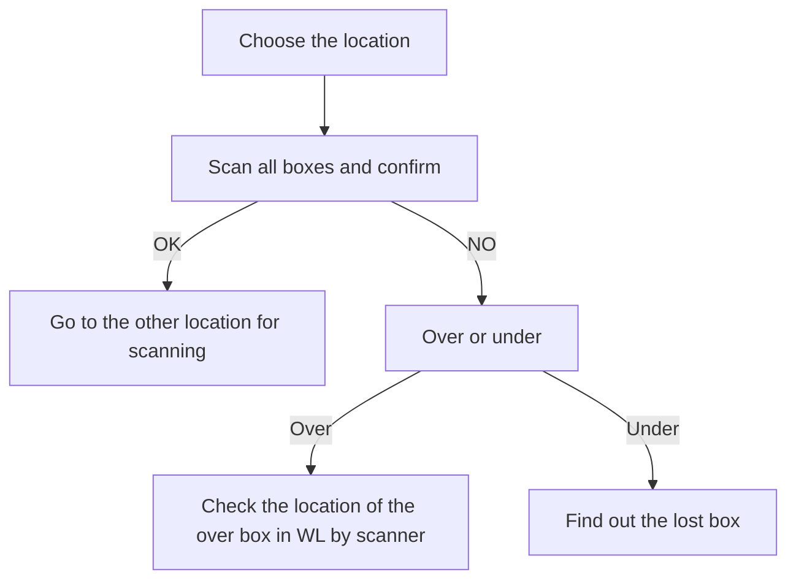
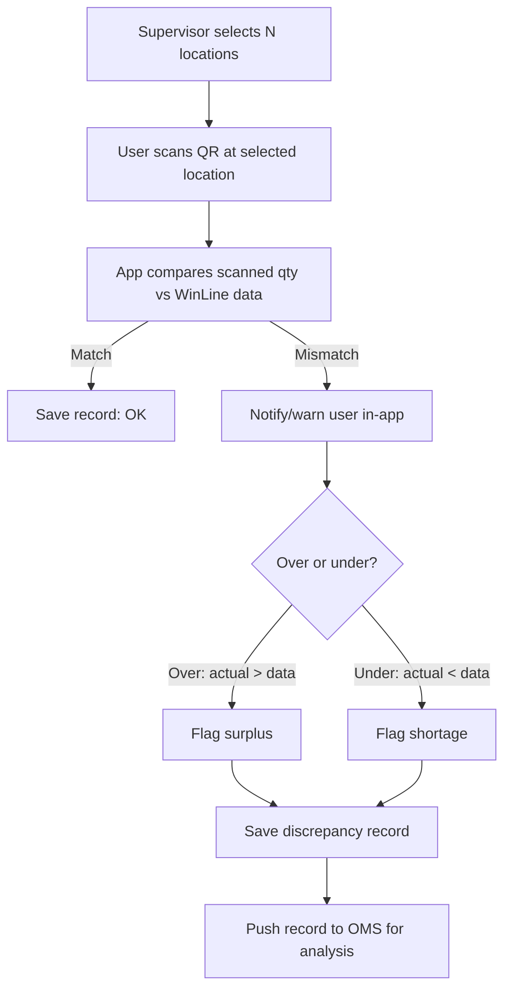
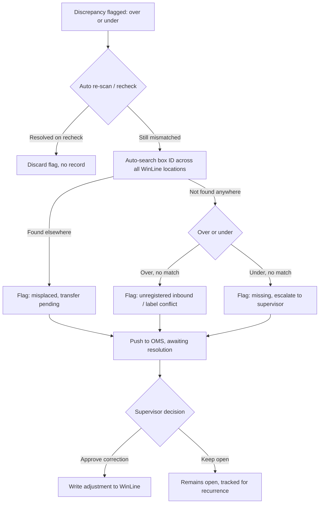
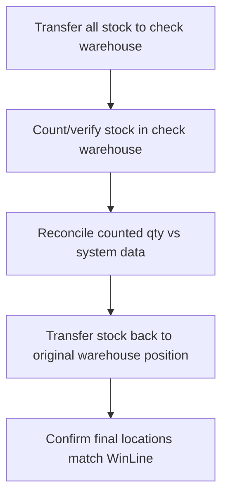
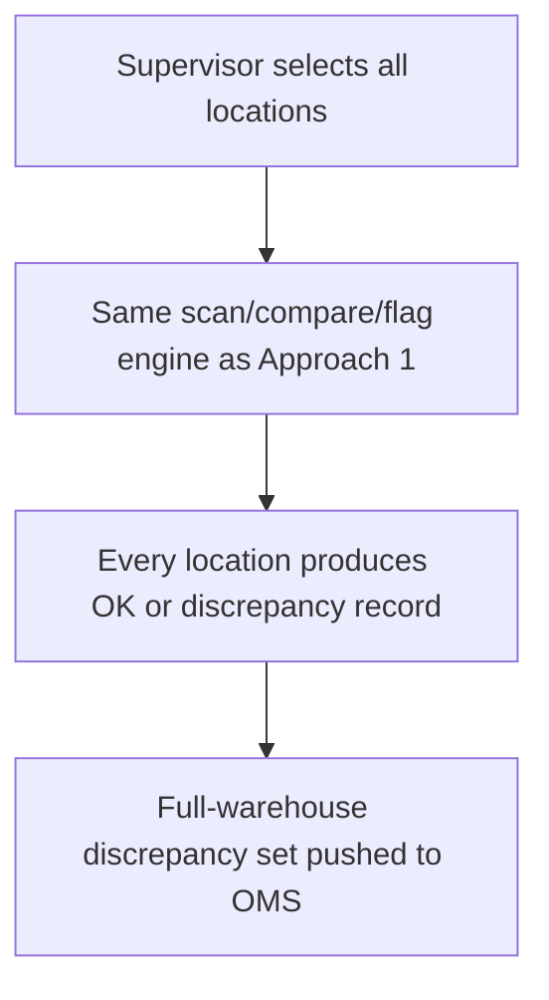

# STO (Stock Opname) Feature Proposal — Framas Scanner App

**Last updated:** 2026-07-14 | **Status:** Draft — for discussion

## Background

The Framas Scanner app already supports a location-level scan/confirm flow:

This is the reference behavior the STO feature extends: a location is scanned, the count is compared against system data (WinLine), and any mismatch is investigated. STO needs to formalize this into a repeatable, auditable stock-take function with two modes: **partial** (spot-check) and **full** (whole-warehouse).

## Objective

Give supervisors a way to trigger a stock count — either targeted or complete — reconcile scanned quantities against WinLine data, capture every discrepancy as a record visible in OMS, and drive a clear resolution path instead of leaving "over/under" as a dead end.

---

## Approach 1 — Partial STO (spot-check)

**Idea:** Supervisor selects an arbitrary subset of locations. User scans QR codes at those locations. The app compares scanned quantity vs. system quantity per location:

- Mismatch → notify/warn the user immediately.
- Actual **less than** system data → highlighted in the app (shortage).
- Actual **more than** system data → highlighted as well (surplus), not just shortage.
- Every record (location, expected qty, scanned qty, delta, user, timestamp) is saved and surfaced in OMS for analysis.

### Open question: what happens after a discrepancy is flagged?

This is the gap in the current flow — today "over" and "under" are dead-end boxes. Below is the full set of realistic causes and next actions per case, to decide which ones the app should automate vs. leave to a human.

**Case: Over (actual > system data)**

| Likely cause | Detection/next step |
|---|---|
| Box belongs to another location, moved without system update | Auto-search the box ID across all WinLine locations (reuses existing "check location of over box by scanner" step). If found elsewhere → flag as **misplaced, transfer pending** |
| Goods received but not yet entered in system | If box ID doesn't exist anywhere in WinLine → flag as **unregistered inbound**, route to warehouse-in team |
| Duplicate/mislabeled QR code | If box ID matches an already-counted box elsewhere in the *same* STO run → flag as **label conflict**, needs physical inspection |

**Case: Under (actual < system data, "lost box")**

| Likely cause | Detection/next step |
|---|---|
| Box physically moved but transfer not recorded | Auto-search box ID across all locations (existing "find out the lost box" step). If found → flag as **misplaced, transfer pending** |
| Box already shipped/consumed, system not deducted | Cross-check against recent outbound/shipment records for that box ID, if available. If matched → flag as **pending system deduction** |
| Box lost, damaged, or stolen | Not found anywhere in WinLine after search → flag as **missing, requires investigation** |
| Scan error (damaged/unreadable QR, skipped box) | Prompt re-scan/manual recheck before escalating — don't flag as a discrepancy on first miss |

**Cross-cutting process questions to resolve:**

1. **Resolution authority** — only supervisor role can approve a stock correction (adjust WinLine qty), or can any user acknowledge a resolved surplus/shortage?
2. **Escalation SLA** — how long can a discrepancy stay "open" before it auto-escalates (e.g., notify supervisor, block next STO cycle on that location)?
3. **Audit trail** — every discrepancy record needs: location, box ID, expected qty, scanned qty, delta, scanning user, timestamp, resolution status, resolved-by, resolution note. This is what OMS needs to display for analysis.
4. **Recurrence detection** — if the same location shows a discrepancy across multiple STO cycles, flag it as a **systemic issue** (e.g., wrong bin mapping, mislabeled shelf) rather than a one-off count error.
5. **Correction write-back** — does resolving a discrepancy write an adjustment back into WinLine automatically, or is that always a manual step outside the app?

---

## Approach 2 — Full STO (whole warehouse)

Two ways to implement full coverage:

### 2a — Keep the current operational process (physical transfer)

Today's process: transfer **all** stock to a dedicated checking warehouse, count it there, then transfer it back to the correct original warehouse/location.

**Pros:** Every single box is physically handled and verified — highest confidence count. Matches the process staff already know.
**Cons:** Labor-intensive, disrupts normal operations (stock unavailable/in-transit during the count), doesn't scale well for large warehouses, and the "reconcile" and "transfer back" steps still hit the exact same over/under questions as Approach 1 — just batched at the end instead of resolved live.

### 2b — Apply the Approach 1 method at full scope

Same engine as partial STO, but the supervisor selects **all** locations instead of a subset. No physical transfer — stock stays in place, scanned in situ.

**Pros:** No operational disruption, no stock movement risk, can be run incrementally per-zone to eventually cover the whole warehouse, reuses one reconciliation engine instead of building a second one.
**Cons:** Requires scanning every location (time cost scales with warehouse size), and surfaces QR-label integrity issues (damaged/unreadable labels) across the entire warehouse rather than a sampled subset.

---

## Comparison

| | Partial STO (C1) | Full STO — transfer (C2a) | Full STO — scan-only (C2b) |
|---|---|---|---|
| Physical stock movement | No | Yes (double transfer) | No |
| Operational disruption | Low | High | Low–medium |
| Coverage | Sampled | 100% | 100% |
| Reuses same engine | — | No (separate process) | Yes, same as C1 |
| Best for | Frequent spot-checks, trend detection | Periodic full audit where physical handling is already required | Full audit without disrupting operations |

## Recommendation

Build **one** reconciliation engine (scan → compare → flag → OMS record → resolution workflow) that powers both Approach 1 and Approach 2b — full STO is just partial STO with `location scope = all`. Approach 2a stays as-is, a separate physical-transfer process that doesn't need new app logic beyond what already exists.

Before building, the cross-cutting questions above (resolution authority, escalation SLA, audit trail fields, recurrence detection, correction write-back) need answers from the supervisor/OMS side — they determine the resolution-workflow diagram, not just the scan/compare part.

## Next steps

1. Confirm answers to the 5 process questions above with supervisors/OMS owner.
2. Define the OMS record schema (fields listed under "Audit trail").
3. Decide whether box-ID cross-location search (used for both "over" and "under" cases) can query WinLine live or needs a cached/synced lookup.
4. Prototype Approach 1 (partial STO) first — it's the shared engine and the lower-risk rollout.
